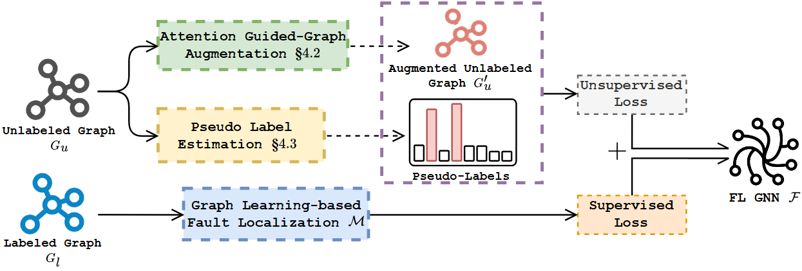

# Legato

  

<em>Legato 
(Semi-supervised <b>Le</b>arnin<b>g</b>-b<b>a</b>sed Faul<b>t</b> L<b>o</b>calization)</em>

This repository contains the core code of Legato. You can find them in the `Legato` folder. The parameters for Legato and the baselines mentioned in the paper are in the `config.txt` file.

## Overview

Legato consists of two main component: Attention Guided-Graph Augmentation and Pseudo Label Estimation. For a more detailed description, please refer to Section IV of our paper